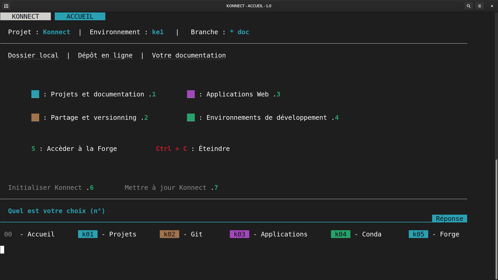

# **Installation de Konnect** - *multiplateformes*

Cette installation s'effectue en **trois étapes chronologiques** :

1. [Installer les pré-requis](#prerequis)
2. [Télécharger et paramètrer Konnect](#parametrage-initial)
3. [Définir votre environnement](#creer-vos-environnements)

---

## Prérequis

??? info "Les prérequis ?"

    Les logiciels présentés ci-dessous sont **tous nécessaires** au bon fonctionnement de Konnect. Konnect ne nécessite pas en soit d'installation, il s'agit d'une succession de scripts bash permettant l'**agancement et l'orchestration** de ces pré-requis.

=== "Windows"
  
    * Télécharger et installer [**Windows terminal**](https://apps.microsoft.com/store/detail/windows-terminal/9N0DX20HK701?hl=fr-fr&gl=FR){target=}
    * Télécharger et installer [**GitBash**](https://git-scm.com/download/){target=} :
        * Choisir `nano` comme editeur par défaut
        * Choisir d'utiliser `Windows terminal - Add Gitbash profile to Windows terminal`
        * Choisir comme `Windows terminal` comme interface bash - **ne pas choisir MinTTY**   
    
    **IMPORTANT** : Il est essentiel de **respecter les trois points concernant GitBash**. Sans quoi des problèmes de compatibilités vont subvenir avec `gh-client`.

=== "MacOS"
  
    * Télécharger et installer [**Git**](https://github.com/git-guides/install-git#install-git-on-mac){target=}

=== "Linux"

    * Télécharger et installer [**Git**](https://github.com/git-guides/install-git#install-git-on-linux){target=}

* Télécharger et installer [**Miniconda3**](https://docs.conda.io/en/latest/miniconda.html#latest-miniconda-installer-links){target=}
* Télécharger et installer [**GitHub client CLI**](https://cli.github.com/){target=}
* Télécharger et installer [**Heroku client CLI**](https://devcenter.heroku.com/articles/heroku-cli#install-with-an-installer){target=}

!!! success "Etape 1/3 - Installations des prérequis terminées"

    **Bravo !** Vous venez de finir une bonne étape. Désormais **vous possédez tous les outils nécessaires**, mais il reste à placer Konnect par dessus, afin de vous **simplifier la vie**.

---

## Installer Konnect 

!!! note "Pour débuter"

    Télécharger et extraire [**Konnect**](){target=} dans son dossier préféré *(ex : Bureau, Documents, etc)*

### Paramètrage initial

=== "Windows"

    * Renommer le fichier `.env.example` en `.env` 
    * Ouvrir le fichier `.env` avec un éditeur de texte et **suivre les instructions**.
    * Activer GitBash dans Windows terminal - [*voir tutoriel*]()
    * Taper la commande suivante : `bash param.sh` et ++enter++

=== "MacOS"

    * Renommer le fichier `.env.example` en `.env` 
    * Ouvrir le fichier `.env` avec un éditeur de texte et **suivre les instructions**.
    * Ouvrir le terminal dans le dossier Konnect
    * Taper la commande suivante : `bash param.sh` et ++enter++

=== "Linux"

    * Renommer le fichier `.env.example` en `.env` 
    * Ouvrir le fichier `.env` avec un éditeur de texte et **suivre les instructions**.
    * Ouvrir le terminal dans le dossier Konnect
    * Taper la commande suivante : `bash param.sh` et ++enter++
    
- [x] Dans le même terminal taper la commande suivante `bash konnect.sh`

---

??? tip "Où est le fichier .env ?"

    === "Windows"

        Pour afficher les éléments masqués sous Windows suivez ce [lien](https://support.microsoft.com/fr-fr/windows/voir-les-fichiers-et-les-dossiers-cach%C3%A9s-dans-windows-97fbc472-c603-9d90-91d0-1166d1d9f4b5){target=}
        
    === "MacOS"
    
        Afin d'afficher les éléments masqués sous MacOS ++cmd+shift++ + .
    
    === "Linux"
    
        Afin d'afficher les éléments masqués sous Linux tapez ++ctrl++ + H
    
    

!!! success "Etape 2/3 - Paramètrage de Konnect terminé"
    
        **Une bonne chose de faite**, vous avez maintenant votre maison numérique Konnect. **Mais il est essentiel** que vous meubliez cette maison, il s'agit de **votre environnement**.

### Créer vos environnements

*Cette partie de l'installation est [disponible en vidéo](){target=}*
    
=== "Bases de Konnect"

    L'environnement suivant vous **assure le minimum** pour utiliser les services de Konnect.

    * **Nom de l'environnement** : `ke1`
    * **Packages** : `gh spyder jupyter jupyterlab nodejs mkdocs mkdocs-material mkdocs-macros-plugin mike jupyter-book`

=== "Applications Web"

    L'environnement suivant vous permet de **créer des applications Web** avec le logiciel Mercury.

    * **Nom de l'environnement** : `mercury`
    * **Packages** : `mercury jupyterlab nodejs`

!!! success "Konnect est prêt à l'emploi !"

---

Vous pouvez désormais **profiter pleinement** des fonctionnalités de Konsilion - Konnect. 
    
[Vos premiers pas avec Konnect](#){ .md-button .md-button--primary }

