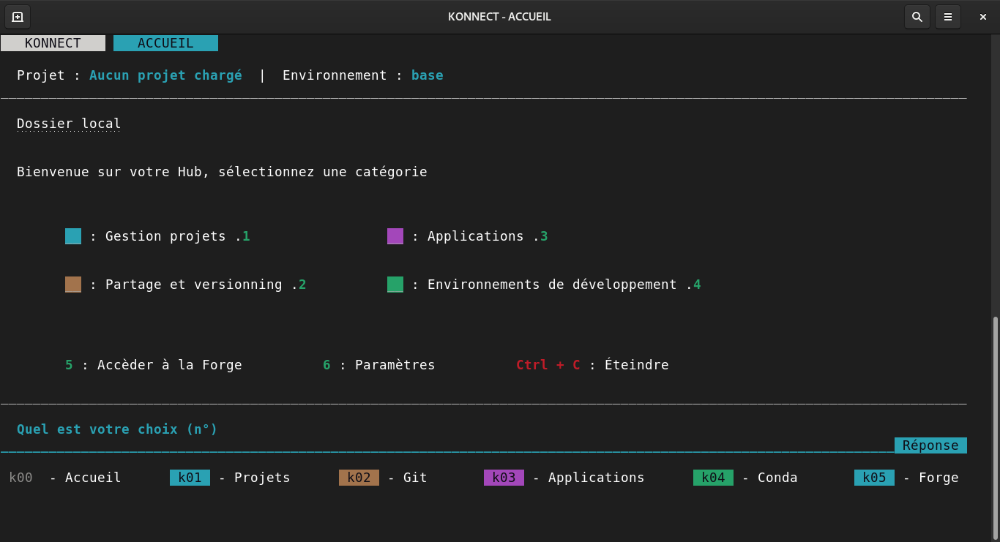
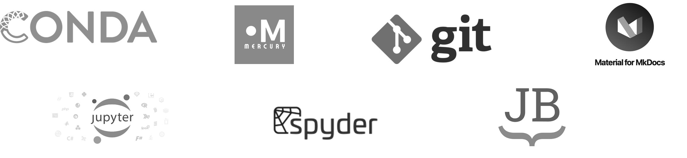

---
hide:
  - navigation
  - toc
---

<head>
<link rel="stylesheet" href="../_css/accueil.css" />
</head>

    <h1 style="color:#3B5F7F; font-size: 60px;"><b>Konnect</b> - DataScience <u>collaborative</u>.</h1>
    
Equipez vous des outils <b>utiles au développement et à la diffusion de vos savoirs</b>.

     
    <a class="md-button" href="./konnect/presentation_konnect">Installation</a>
    <a class="md-button" href="./konnect/presentation_konnect">Prise en main</a>  

??? ksln-info "Pourquoi une interface si "sommaire" ?"

    Afin de permettre au plus grand nombre de **s'approprier cette technologie**, cette dernière est développée uniquement avec le langage bash, **simple mais efficace**.

---

<h2>À <b>quels besoins</b> répond Konnect ?</h2>
 

Afin que l'on puisse coopérer autour de **nos savoirs et projets**, sans partager de lieux physique, alors il est utile de :

* **Mettre en commun** nos fichiers,  modèles, data, rapports, analyses, images, etc.
* **Développer de nouveaux savoirs** en ce basant sur l'existant.
* **Diffusez les nouveaux résultats** et permettre à tout à chacun de s'en saisir.

Pour faire cela il est utile d'acceder à des **services et applications** nécessitant normalement de certaines compétences informatiques, mais néanmoins très utiles **pour produire et diffuser des savoirs** et **collaborer autour de projets communs**. 
    
Nous vous proposons d'utiliser Konnect afin d'**englober en un seul outil**, autant de [fonctionnalités](../fonctionnalites/site_web/start_site_web/) utiles aux usages coopératif. Le tout en Open source afin d'assurer une bonne accessibilité et appropriation des outils.   

 

     
    
"Afin que la compréhension des outils n'interfère pas avec l'acquisition des méthodes"
 

 

 
    <h2>Pour une <b>Recherche & Développement</b> libre et collaborative</h2>
 
    Voici <u>quatres grands principes</u> nécessaires à la réalisation de projets collaboratifs.   
    <ul>
        <li><b>Open community</b> : La communauté est du fait de la notion de collaboration, un pilier centrale. Incontournable, elle apporte soutient et intéligence collective, que nous pensons favorite face à la course à l'Inteligence Artificielle.</li>
        <li><b>Open data</b> : Les donnnées en libre accès sont essentielless pour alimenter les modèlisations, analyser leur pertinence et valider les hypothèses.</li>
        <li><b>Open model</b> : Les modèles numériques sont développés afin d'anticiper une technique, un comportement et ses effets dans le "vrai monde". Ainsi déployés, les modèles permettent de corriger les écarts en comparant avec les mesures et résultats de prototypes.</li>
        <li><b>Open doc</b> : La documentation permet de traverser les âges et de pérenniser un projet. Utile à la médiation et pouvant être utilisée pour la formation, une documentation de qualité est essentielle pour qu'un projet soit constructif et transmissible.</li>
    </ul>
     
    

        <button class="neumorphic-btn" onclick=""> OPEN COMMUNITY</button>
        <button class="neumorphic-btn" onclick=""> OPEN DATA</button>
        <button class="neumorphic-btn" onclick=""> OPEN MODEL</button>
        <button class="neumorphic-btn" onclick=""> OPEN DOC</button>
    
 

    
    

<h2 style="text-align: center;">Les technologies embarquées</h2>

 
??? ksln-info "Il existe des applications de Bureau pour ça, pourquoi Konnect ?"

    Le fait que Konnect **utilise uniquement bash**, lui apporte une **rapidité d'execution** defiant toute concurrence. Ainsi Konnect pèse aux alentours de 6Mo, n'installe aucune nouvelle technologie que celle existante, c'est une surcouche vous traduisant **l'informatique en francais**.

    Pour ce qui est des applications telles que GitHub Desktop, GitKraken, Anaconda, Docker Desktop ... elles sont **lourdes et gourmandes en ressources** informatiques, nécessitant ainsi un ordinateur suffisament puissant. Cela représente un **frein à l'acquisition des outils** utiles à la diffusion des savoirs.

